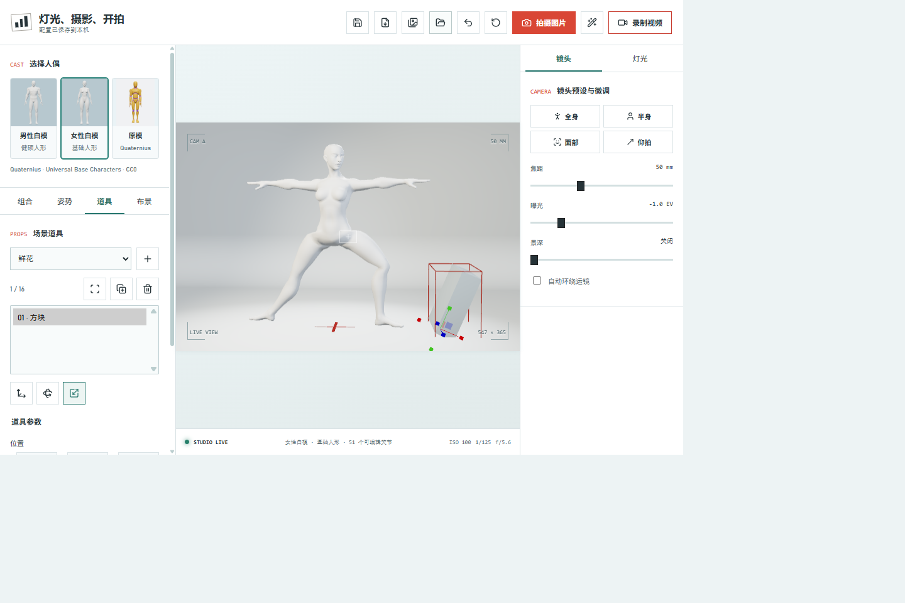

# 灯光、摄影、开拍

一个基于 TypeScript、React、Ant Design 和 Three.js 的 3D 虚拟摄影棚沙盒，Python/Flask 提供认证、存储与 AI 接口。没有评分或任务，自由摆姿、布光、布景和拍摄。



实际运行界面：选择人偶与预设组合，微调姿势、道具、镜头和灯光，再拍照或导出视频。演示使用自带的 Quaternius CC0 女性白模。

[运行](#运行) · [AI 修图](#ai-修图) · [功能](#功能) · [操作](#操作) · [编辑姿势数据](#编辑姿势数据) · [代码结构与扩展](#代码结构与扩展)

## 运行

需要 Python 3.10+ 和 Node.js 22.12+，无需管理员权限。首次在项目目录的 PowerShell 终端安装依赖：

```powershell
python -m venv .venv
.\.venv\Scripts\python.exe -m pip install -r requirements.txt
npm ci
```

之后运行：

```powershell
.\start.ps1
```

Windows 开发模式是默认入口，也可运行 `npm run dev`。启动器同时运行 Python API（4173）和 Vite（4178），自动打开 http://127.0.0.1:4178/，不先执行生产构建或测试。React 使用 Fast Refresh，CSS 使用 Vite 热更新；模型、姿势等静态资源变化时刷新页面，数据库写入不会刷新。Python 文件变化会重启本地 API，调试器保持关闭。按 Ctrl+C 停止本次启动的服务；已有服务不会被自动终止。

可选参数：`.\start.ps1 -NoBrowser` 不打开浏览器；`.\start.ps1 -Port 4183 -FrontendPort 4188` 同时更改 API 与前端端口，代理目标自动匹配。端口冲突会报错，不再静默换端口。启动器退出后恢复原来的 `STUDIO_API_URL` 环境变量。

生产模式运行 `.\start.ps1 -Mode Production`：先执行类型检查与生产构建，再启动 Python 同源页面，默认 http://127.0.0.1:4173/。涉及认证回调的验收使用这一同源地址。缺少构建时 Python 页面返回 503 和构建提示。若本机策略阻止执行 PowerShell 脚本，不要更改系统安全策略：开发时分别运行 `.\.venv\Scripts\python.exe server.py --reload --no-browser --strict-port` 和 `npm run dev:client`；生产时先 `npm run build`，再 `.\.venv\Scripts\python.exe server.py --strict-port`。单独运行 Vite 且 API 使用非默认端口时设置 `STUDIO_API_URL`。

页面与 API 需要 Python 服务，不能直接以 `file://` 打开。默认服务只监听本机。React、Ant Design、Three.js、three-vrm 和 Lucide 从 npm 安装后由 Vite 本地打包，不运行时请求 CDN；模型、缩略图和姿势数据随项目提供。首次安装依赖需要联网，普通摄影棚及本地数据功能在安装构建后无需联网，AI 修图仍需连接 Azure。

Three.js 0.180.0、three-vrm 3.5.5、Lucide 0.468.0 保持原版本，其他依赖由 [package-lock.json](package-lock.json) 锁定。原有 vendor 文件和许可证仍保留用于独立实验，主应用不再通过 import map 加载它们。资源来源见 [资源清单](assets/vendor/manifest.json)。仅需更新旧实验资源时运行：

```powershell
.\.venv\Scripts\python.exe scripts/vendor_dependencies.py --proxy http://127.0.0.1:1080
```

此脚本只通过指定代理下载固定版本的 npm 包，验证完整性并提取使用到的模块及其依赖，不修改系统或浏览器代理设置。新增第三方模块时，在脚本的入口列表中补充模块后重跑；日常启动无需执行下载。

## 云端与认证

线上地址：https://web-lights-camera-action-46df95.azurewebsites.net/

Azure App Service Linux **F1 / Free**，支持当前 Entra 租户用户登录与独立账号密码登录。指定 Entra 管理员通过顶部账户入口创建或重置密码账户，没有公开注册。配置、相册和个人组合按用户隔离；浏览器自存姿势按身份分开，不跨设备同步。免费的是 Web App 托管，AI 模型调用仍可能计费。部署参数、维护与验证范围见 [DEPLOYMENT.md](DEPLOYMENT.md)。

默认回环地址开发模式不要求登录。可设置 `AUTH_ORIGIN=http://127.0.0.1:4173` 测试认证，必须使用同一端口；Azure 根据平台 `WEBSITE_HOSTNAME` 强制认证，配置缺失时拒绝启动。当前入口需要 Python 提供认证状态接口，不能仅用静态文件托管；上面的本机监听限制仅针对默认开发启动器。

## 本地保存与相册

数据写入项目目录下的 `.studio-data/studio.sqlite3`，使用 SQLite 事务保存，刷新页面或重启正常服务后仍在。它不是浏览器缓存；清除浏览器缓存不会删除这份相册。运行同一项目的正常服务共享数据，前端测试服务使用独立临时数据库，不用于正式保存。

- **摄影棚配置**：修改人物、姿势、相机、灯光、画幅或背景后自动保存当前配置。左上角显示待保存、保存成功或失败；顶部磁盘按钮可立即保存，旁边的文件下载按钮仍可导出独立项目 JSON。打开应用会恢复已存配置。当前保存的是一份最近配置，不是多套命名预设。
- **修图配置与素材**：提示词、质量、尺寸和当前人物/服装图选择自动保存。上传的参考图进入对应素材库，修图窗口可直接选择已存图片；移除当前参考图只取消选用，不删除库中原图。刷新后恢复参数与选择，但不会恢复上传计费授权。
- **拍摄相册**：点击拍照先存入相册，不再立即下载。顶部“相册与素材”按钮进入相册，选中图片后可预览原尺寸、下载、用于修图或删除。用于修图不会发起生成，也不会改动 3D 模型。
- **生成历史**：Azure 成功返回后，服务端先保存结果和当次提示词、质量、尺寸，再响应浏览器。即使浏览器页面已关闭，只要本地服务仍在运行且请求成功完成，结果仍会入库。历史图片可以下载，或作为新原图继续修图；每次再次生成仍需授权并可能计费。

相册按拍摄、生成历史、人物、服装分类，每次加载 40 张，支持搜索已加载名称和继续加载。各分类均可导入已有 PNG/JPG；人物和服装素材每张上限 8 MB，照片与历史图片每张上限 32 MB，均限制 1600 万像素。AI 修图输入仍须每张不超过 8 MB。删除需要确认且不能撤销。视频录制仍直接下载 WebM，暂不进入图片相册。

保存失败不会提示成功：已拍摄或生成的图片暂留当前页面的相册“未保存”项，可重试保存或手动下载。存在未保存内容时会提示离页风险；请确认保存状态后再关闭页面。多窗口修改同一配置时会拒绝旧窗口覆盖，提示先导出当前配置再刷新。程序不会自动重试收费的 AI 请求。

数据库和照片不上传云端、不进入 Git，也不能通过静态文件 URL 下载；本地数据接口要求防跨站令牌。数据库本身没有加密，请按私人照片保管。备份时先停止服务，再复制整个 `.studio-data` 目录；恢复时停止服务后放回备份。独立项目 JSON 不包含整份相册，原有自定义姿势库仍使用浏览器 `localStorage`，需要单独导出姿势备份。

此前已经关闭页面、未保存的照片或生成结果无法自动找回；以前下载的图片可通过相册导入。服务重启会中断尚未完成的生成，不代表 Azure 一定停止计费。

## 站内人物制作

在“人物”面板点击“新建人物”，按照“基础人体 → 体型 → 面容 → 造型 → 完成”五步创建角色。选择女性或男性人体后进入专用创建模式，继续使用摄影棚的同一个 3D 视口，不打开新站点。可用上一步、下一步或步骤导航切换；体型和面容提供四种预设，当前步骤可随机、重置，外观调整可撤销最近 30 次。面部按轮廓、下颌、眼睛、鼻子、嘴唇分区；数值可直接输入，颜色可选色板或自定义。预览提供全身、面部特写及正面、左右侧、背面视角。最终命名后“完成并入场”保存为新人物并选中，取消新建恢复原人偶，结束制作恢复摄影机视角。制作期间锁定其他场景编辑，保存失败显示错误并保留草稿。“编辑当前外观”仍可修改已有模型；白模只提供其实际支持的操作。

新建人体内置短发、波波头、长发及两套日常服装，默认已经穿着衣服，不需要导入清单。20 个双向部位控件覆盖脸宽、脸长、下巴宽度与长度、下颌、鼻翼与鼻梁及鼻长、眼睛大小/位置/眼距、嘴宽与唇厚、面部成熟度、躯干/臀部/颈部宽度、躯干和肩部肌肉、腹部紧致度；另有胖瘦、圆润/方正脸型及身高、整体宽度。这些控件驱动 44 个真实网格变形，身体和可穿戴部件联动变化，正负变形不会同时叠加。身高与整体宽度仍是缩放；颜色是材质叠色，不是替换纹理。新增变形追加在原有八项之后，兼容旧配方。当前男女 GLB 分别约 29/33 MB，首次加载和低性能设备上的初始化会更慢。

人体网格、骨架、权重、变形目标及服装发型来自 MakeHuman Community 的官方 CC0 数据，并用 Three.js 的 OBJLoader / GLTFExporter 离线转换为内置 GLB；运行时沿用 three-vrm 的标准人形骨架与 FK/IK。仅使用数据，不引入其 AGPL 应用代码，也不需要安装 MakeHuman、MPFB 或 Blender。部件组合机制参考 [M3-org/CharacterStudio](https://github.com/M3-org/CharacterStudio)，没有搬入其整站、CharacterManager 或授权受限的示例角色。来源与可复现构建见[模型说明](assets/characters/README.md)。这是一套有限的基础人体制作，不包含任意服装自动适配、精细面部雕刻或物理布料模拟。

用户界面不再提供“载入部件清单”或技术网格列表。内置造型直接可选，底层部件分组、互斥和旧配方解析仍保留兼容性。流程借鉴游戏角色创建的预设加细调方式，不使用 EVE 或魔兽世界的角色素材，也不包含种族库、面部直接拖拽雕刻、妆容或任意服装导入适配。

“导入 VRM”接受不超过 40 MB、素材内嵌的独立 VRM，需要确认素材使用权。导入成功后加入人偶列表；解析失败保留当前人物。原始 VRM 可原样导出，制作后的外观目前以配方保存，尚不烘焙导出新的 VRM。模型二进制与外观配方分别保存在用户隔离的数据库表中，项目 JSON 只记录人偶 ID；跨数据库搬迁需备份整个数据目录，单独复制项目 JSON 不会携带自定义模型和配方。

“导出 GLB”直接复用 Three.js `GLTFExporter`，导出当前人物的可见网格、材质、骨架和外观比例，不包含摄影棚、动画片段或 VRM 专有扩展。这是通用 GLB，不是新的 VRM，也不能经“导入 VRM”入口重新导入。

## AI 参考图生成预设

“组合”面板提供 20 组内置手动组合，包含姿势、机位、焦距、画幅和三灯参数，分为肖像、时尚封面、写真集、其他（动作练习），每类 5 组。它们复用已有姿势库，不来自照片分析，也不使用此前被弃用的 AI 结果。全部采用中性纯色背景，缩略图由女性白模实际渲染。内置组合只读、不写入个人数据库、不占个人 100 条额度；应用后可微调、撤销或导出项目。完整清单见 [内置组合说明](assets/shots/README.md)。

AI 分析入口继续保留：上传一张单人 PNG/JPG，由本机配置的视觉 AI 分析人物姿势、手持道具、镜头和灯光，返回可编辑的场景配置。不还原参考图背景与家具，应用新旧 AI 预设时均使用中性纯色背景。AI 保存结果进入独立的个人预设列表，不会覆盖内置组合；目前分析质量仍需改进。

姿势分析聚焦 21 个身体关节，不推测手指。肘膝由 AI 输出弯曲量，程序按人偶骨骼的轴和左右符号转换，避免任意欧拉角造成侧折；其余关节采用父骨骼局部坐标。遮挡和画外部位使用保守默认姿态并要求模型说明不确定性。这仍是通用视觉模型的单图估计，不是经过关键点标注评测的动作捕捉，不能保证遮挡部位或复杂姿势的准确还原。

服务端复用 `.env` 的 `AZURE_OPENAI_ENDPOINT` 和 `AZURE_OPENAI_API_KEY`，另需设置：

```dotenv
AZURE_OPENAI_VISION_DEPLOYMENT=你的视觉模型部署名
AZURE_OPENAI_VISION_API_VERSION=2024-10-21
```

部署必须支持 Azure Chat Completions 的图片输入、严格 JSON Schema 结构化输出和 `max_completion_tokens`；图片编辑用的 `gpt-image-2` 不能代替此视觉分析部署。输出 Schema 约束画幅、分类和关节字段，本地仍校验数值范围；名称指预设标题，不是人物姓名。完整字段见 [.env.example](.env.example)。endpoint 使用 Azure 资源根地址，进程环境变量优先；点击面板刷新图标可重新读取配置。不要在浏览器填写或分享密钥，接口不会返回 endpoint/key。缺少配置时禁止发送请求。

1. 上传图片，在预览中确认是单人照片；上限 8 MB、1600 万像素。
2. 明确同意图片上传与可能的计费，再点击“分析生成”。服务让 AI 统计画面人数；模型报告零人或多人时拒绝生成。人数判断依赖模型，不保证无误。
3. 查看 AI 给出的名称、分类与不确定性说明。生成不会自动应用或保存；眼睛图标显式预览配置，替换当前人物姿势、道具、背景、镜头和灯光，但保留当前人偶模型，可撤销。
4. 修改名称和分类后点击“保存预设”。保存的是这次 AI 生成的配置，之后的场景微调通过摄影棚配置或项目 JSON 另行保存。分类库最多 100 项，刷新后保留，可应用或确认删除。

分析通过 `/api/ai/analyze` 发送一张图片，不调用图片编辑接口，也不执行 AI 返回的代码。前后端校验关节名称、数值范围、相机、道具和灯光；不合格结果不应用、不保存。服务不自动重试付费请求，与修图共用并发锁。超时或关页不保证上游取消计费；尚未保存的结果只在当前页面保留，离页会提示。

保存的预设、来源文件名和参考图缩略图进入本地 SQLite；完整上传图片不由分析接口存档。参考图仅在同意分析时上传到配置的 AI 服务。使用有权上传的图片。单张图存在深度、焦距、遮挡与骨骼歧义，结果是模型估计，通常需要微调，不是摄影测量或精确重建。道具仅限当前支持的类型，家具可由方块近似。

当前自动化验收使用明确标记的模拟 AI 响应，不代表真实视觉模型的分析质量；真实调用需要用户自己的配置、图片和授权。

## AI 修图


截图展示修图前的原图预览与参数设置，未上传参考图、未发起生成，不代表 AI 生成效果。真实修图需配置 Azure 并明确同意上传与计费。

点击原图、修图结果、已选人物图或服装图可打开大图预览，支持滚轮/按钮缩放、拖动、双指缩放、适应窗口与原始大小。Esc 或关闭按钮只关闭大图，保留修图窗口；参考图旁的图片加号用于更换图片。预览不会上传图片或调用 AI。

在项目根目录创建 `.env`，格式参照 [.env.example](.env.example)。本地 `.env` 已被 Git 忽略，静态服务也不会提供下载；不要把密钥发到聊天或提交到仓库。

| 配置项 | 内容 |
| --- | --- |
| `AZURE_OPENAI_ENDPOINT` | Azure 资源根端点，例如 `https://your-resource.openai.azure.com`；不是 Foundry 项目 URL，也不要附加 `/openai/...` 路径 |
| `AZURE_OPENAI_API_KEY` | 对应资源的 API 密钥 |
| `AZURE_OPENAI_IMAGE_DEPLOYMENT` | 已部署的 GPT Image 2 的**部署名**，默认 `gpt-image-2`，可与模型名称不同 |
| `AZURE_OPENAI_API_VERSION` | 默认 `2025-04-01-preview`；以你的部署支持的 Images Edit API 版本为准 |

服务器读取 `.env`，同名进程环境变量优先。修改文件后在修图窗口点击“重新检查配置”即可，无需把密钥传给浏览器。未配置 Azure 不影响普通拍照。

1. 先从“服装拍摄”分类选择姿势并调整取景。每次点击顶部的“AI 修图”图标，都会重新拍摄当前场景并显示为原图，不下载、不入相册、不增加拍摄计数，也不调用 Azure。普通拍照按钮则保存到拍摄相册。也可从相册选图“用于修图”，或在修图窗口导入原图并保存到相册。
2. 分别上传一张“人物图”和一张“服装图”，两者均可选，支持各自更换、预览和移除。人物图用于面部特征与发型，服装图用于款式、颜色、面料及图案；原图提供姿势、构图和光照。建议使用清晰的单人人物照，以及服装完整可见的平铺、挂拍或穿着照片。修图要求留空或清空后以灰色占位提示显示默认要求的内容，提交时自动使用这段默认要求；也可输入并保存自定义要求。
3. 选择质量、尺寸，确认上传与计费后点击“生成修图”。第一张始终为原图，其后按人物图、服装图的顺序附加已选图片；仅上传服装图时，第二张就是服装图，接口仍明确标记其用途。没有人物图时保留原图人物，没有服装图时沿用人物图或原图衣着。Azure 收到原图、已选参考图和提示词；请只使用有权上传和处理的素材。重新拍摄、更换或移除图片后需要重新勾选授权。
4. 在原图与结果间切换查看，下载 PNG，或点击“以结果继续修图”把结果作为下一次输入。继续修图不会自动发起新的收费请求。

每次请求生成一张图片；修图原图、人物图和服装图各限 8 MB、1600 万像素，支持 PNG/JPG。本地 JSON 请求上限为 46 MB，以容纳三图输入或最大 32 MB 历史图片的 Base64 归档。默认标准质量、自动尺寸，也可指定横向、竖向或方形尺寸。素材、参数及成功结果保存到本地数据库，不嵌入项目 JSON，也不会修改 3D 模型。当前预览标签和未归档的即时场景原图仍属于页面临时状态。生成无法保证人物、姿势、版型、图案或文字逐像素一致，不是精确试衣、尺码测量或实物效果保证。

每次点击生成都可能计费。关闭修图窗口不取消已提交任务；重开会刷新当前场景原图，旧任务完成后不会覆盖它，可在“上次修图结果”中查看或下载。超时或断网也不代表 Azure 已取消，不会自动重试。服务同一时间只接受一个修图任务。错误提示区分缺少配置、鉴权、部署、限流、内容/参数拒绝和超时，不回传 Azure 原始错误中的敏感内容。

接口采用 Azure [Images Edit API](https://learn.microsoft.com/en-us/azure/ai-foundry/openai/how-to/dall-e#call-the-image-edit-api) 的 multipart 上传，输出 PNG。真实效果和可用性需要你自己的 GPT Image 2 部署、权限和额度；自动化测试使用模拟响应，不代表已完成真实 Azure 生成验收。

单元测试当前已禁用，开发启动和构建均不执行测试。

## 代码结构与扩展

React 入口为 [src/main.tsx](src/main.tsx)，[src/App.tsx](src/App.tsx) 负责主题、认证与启动错误。工作区由 [src/layout/StudioLayout.tsx](src/layout/StudioLayout.tsx) 装配：项目顶栏、七类工具导航、可折叠参数区、主视口和底部拍摄栏。手机端将视口和拍摄入口放在上方，横向工具导航与独立滚动参数区置于下方。

顶栏、视口、拍摄栏分别位于 [src/layout/StudioHeader.tsx](src/layout/StudioHeader.tsx)、[src/layout/StudioViewport.tsx](src/layout/StudioViewport.tsx)、[src/layout/CaptureBar.tsx](src/layout/CaptureBar.tsx)。场景与摄影参数分别由 [src/panels/ScenePanels.tsx](src/panels/ScenePanels.tsx)、[src/panels/CameraPanels.tsx](src/panels/CameraPanels.tsx) 管理；切换工具只改变可见性，不卸载控件或重建场景。[src/StudioMarkup.tsx](src/StudioMarkup.tsx) 保留素材窗口容器与兼容导出。[src/components/StudioControls.tsx](src/components/StudioControls.tsx) 提供 Ant Design 按钮和受控数值控件。布局样式集中在 [src/layout/studio-layout.css](src/layout/studio-layout.css)。

React 界面、认证与存储客户端、场景协议、姿势库和组合预设数据层使用严格 TypeScript。组合预设面板、姿势分类搜索与展开窗口、保存及另存窗口由 React 状态和 Ant Design 控件管理；展开与收起共享筛选和选中状态，保存失败保留输入，姿势选择与保存显式触发配置持久化。

`src` 下的自有应用源码已全部迁为 TypeScript / TSX，已移除 `allowJs`，统一通过严格类型检查；第三方 Three.js、VRM、Lucide 及 vendored JS 未改写。React 入口仍为 [src/main.tsx](src/main.tsx)，原生场景控制器已独立命名为 [src/studio-controller.ts](src/studio-controller.ts)，负责渲染装配、项目恢复和撤销。

人物关节、布景、摄影参数、顶栏和拍摄栏由 [src/studio-model.ts](src/studio-model.ts) 的类型化快照与命令驱动；道具、相册、修图和预览通过同一 React 根的 Portal 渲染，不再用隐藏输入框、MutationObserver 或模拟 DOM 事件同步状态。文件选择、焦点、原生模态层和 Three.js 交互保留浏览器/渲染器 API，不把 Three.js 对象放入 React 状态。版本 1 项目与姿势数据继续兼容；测试和独立实验脚本保留 JavaScript。开发服务器只对前端源码及资源热更新，数据库与运行产物写入不会刷新页面。

`createStudioController(signal, model, views)` 显式装配场景；[src/studio-runtime.ts](src/studio-runtime.ts) 管理渲染资源，[src/project-session.ts](src/project-session.ts) 管理恢复、撤销与保存。React 卸载或初始化失败时取消旧实例：停止渲染、媒体轨道与计时器，移除监听器和 ResizeObserver，释放模型、材质、纹理、gizmo、缩略图 URL 与 Portal 视图。异步加载在返回后检查实例是否仍有效；认证轮询和 fetch 包装也随实例清理。修图提交固定输入快照，重开窗口不会让旧请求覆盖新原图；中止浏览器请求不保证 Azure 停止处理或计费。

后端入口 [server.py](server.py) 仅负责命令行启动并导出 `app`；[studio_app.py](studio_app.py) 负责 Flask 路由、安全边界和认证装配，[ai_service.py](ai_service.py) 负责独立的 Azure 请求与图像校验。认证、SQLite 存储与协议校验继续使用原模块，HTTP 接口和生产 `server:app` 入口不变；部署脚本包含所有后端模块。

| 模块 | 职责与扩展入口 |
| --- | --- |
| [src/camera-framing.ts](src/camera-framing.ts) | 无副作用的包围盒取景计算，返回相机位置和目标 |
| [src/studio-scene.ts](src/studio-scene.ts) | 无影墙、背景平面、位置标记和灯具工厂；灯光定义集中在 `LIGHT_DEFINITIONS` |
| [src/capture.ts](src/capture.ts) | 拍照、录制及清理；通过 `takePhoto`、`toggleRecording`、`isRecording` 接入，新增输出流程在此扩展 |
| [src/scene-types.ts](src/scene-types.ts) | 姿势、道具、灯光、场景项目和组合预设的共享类型 |
| [src/pose-schema.ts](src/pose-schema.ts) | 标准关节和姿势协议，不依赖渲染或界面 |
| [src/project-schema.ts](src/project-schema.ts) | 项目校验、默认状态与旧版字段归一化；新增保存字段时同时更新这里及控制器的捕获/恢复逻辑 |
| [src/shot-presets.ts](src/shot-presets.ts) | 预设校验、分类、20 组手工组合与项目配置转换 |
| [src/shot-model.ts](src/shot-model.ts) | 图片校验、授权分析、草稿和分类库存储、异步请求与失败恢复 |
| [src/shot-browser.tsx](src/shot-browser.tsx) | React 组合列表、上传授权、草稿编辑与显式预览保存 |
| [scene_schema.py](scene_schema.py) | 服务端 AI 场景与预设库的参数校验 |
| [src/prop-schema.ts](src/prop-schema.ts) | 道具类型、默认尺寸与项目数据校验 |
| [src/props.tsx](src/props.tsx) | 道具几何体、React 选择与数值编辑、复制删除、快照和资源释放 |
| [src/pose-library.ts](src/pose-library.ts) | 数据文件加载与校验，新增姿势只改 JSON |
| [src/pose-browser.tsx](src/pose-browser.tsx) | React 分类、搜索、弹窗和选中态，通过回调通知应用，不直接操纵角色 |
| [src/pose-store.ts](src/pose-store.ts) | 本地姿势覆盖与新增、持久化校验、写入失败及多页面冲突保护 |
| [src/pose-save.tsx](src/pose-save.tsx) | React 保存按钮与另存窗口，采集名称和分类，通过回调提交姿势 |
| [src/character.ts](src/character.ts) | 人偶生命周期、材质与骨骼编辑 |
| [src/character-appearance.ts](src/character-appearance.ts) | 当前模型的整体比例、材质色与已有 morph 适配，预览和外观配方恢复 |
| [src/pose-ik.ts](src/pose-ik.ts) | 四肢 CCD 求解、距离与关节限制、端点朝向保持 |
| [src/mannequin.ts](src/mannequin.ts) | 自有白模骨骼映射与 VRMHumanoid 适配，非第三方库源码 |
| [src/retouch.tsx](src/retouch.tsx) | React 修图表单、上传授权与请求快照，摄影控制器通过回调提供原图 |
| [src/library-client.ts](src/library-client.ts) | 类型化本地数据接口、令牌、图片读取与配置写入队列 |
| [src/auth-client.ts](src/auth-client.ts) | 会话身份、过期跳转和跨账号请求保护 |
| [src/library.tsx](src/library.tsx) | React 相册与素材分类、预览、下载、复用、删除及保存失败重试 |
| [src/image-preview.tsx](src/image-preview.tsx) | React 大图预览、缩放、触摸手势与焦点恢复 |
| [src/react-view.tsx](src/react-view.tsx) | 状态快照订阅、统一 Ant Design 主题和可释放的 React 子视图 |
| [src/lifetime.ts](src/lifetime.ts) | 实例取消信号、资源清理、动画帧、计时器和临时 URL |
| [src/dom.ts](src/dom.ts) | 类型化必需节点查询；节点缺失时明确报错 |
| [storage.py](storage.py) | SQLite 图片、缩略图和配置事务；不包含 Azure 调用 |

依赖方向保持为“入口装配 → 功能模块 → 数据协议”，模块不要反向导入入口，也不要传入可任意修改的全局应用对象。控制器随 App 挂载创建、卸载释放，各自持有内部状态；需要其他模块完成的工作通过明确回调连接。项目和独立姿势仍使用版本 1，已有 ID 和兼容导出保持不变。加入不兼容字段前应先设计迁移策略。

### 验证策略

单元测试已禁用但源码保留：`npm test` 仅输出禁用提示，不启动浏览器或后端；Playwright 的模块测试入口已跳过，Python 两个单元测试类也已标记跳过。开发启动不执行构建或测试，生产构建仅执行 TypeScript 检查与 Vite 打包。

日常验证使用 `npm run typecheck`、`npm run build` 和必要的启动/热更新检查。确需手动浏览器 E2E 时，可先安装 Chromium（`npx playwright install chromium`），再运行 `npm run test:e2e`；该入口不执行已禁用的模块单元测试。它使用 4190/5190 端口及临时数据库，不用于保存正式作品，不调用真实收费 AI。默认不截图，trace 也不采集截图；历史测试源码和实验资料继续保留，不代表当前版本已完成全部回归。

## 功能

- 三个可选人偶：男女白模和 Quaternius 原模；默认女性白模，73 种内置姿势，含 12 个服装拍摄姿势，初始姿势为瑜伽战士
- 单人参考图由配置的视觉 AI 生成场景预设，支持预览、分类、命名、本地保存和删除
- 鲜花、剑、枪、方块四类道具，支持 XYZ 位置、旋转、尺寸、主色、复制删除、撤销及项目保存
- 51 个标准关节的 XYZ 旋转编辑，包含手指；支持关节控制点与旋转环
- 手腕、脚踝 IK 拖拽，自动带动肩肘或髋膝，带基本肘膝限位及可达距离限制
- 独立姿势 JSON 导入导出，换人偶时保留姿势
- 姿势库保存与另存为，支持自定义名称和分类，刷新后保留本地修改
- 三灯开关、亮度、颜色与 XYZ 位置；灯架显示开关
- 默认开启“去除影子”，可随时恢复投影，保留灯光和材质明暗
- 连续弧形无影墙，地面与背景墙平滑相接；六种摄影背景以及本地图片导入
- 自由镜头、焦距、曝光与景深
- 全身、半身、面部及仰拍一键取景，默认曝光 -1 EV
- 分区物理材质：皮肤、头发、衣料和眼部采用不同反光；保留原法线贴图，贴图过滤最高 8 倍各向异性
- 四种构图比例
- 拍摄相册和生成历史：本地持久保存、预览、下载、复用与删除；WebM 视频导出
- Azure Foundry GPT Image 2 修图：提示词、独立人物图与服装图、按原图姿势合成、原图/结果预览与 PNG 下载
- 基础撤销与摄影棚重置
- 自动环绕运镜
- 摄影棚配置自动保存与恢复；保留 JSON 项目导入导出，背景图片包含在配置中

## 操作

左侧保留人偶选择，下方按“组合、姿势、道具、布景”切换；右侧按“镜头、灯光”切换。标签支持左右方向键与 Home/End。手机端视口在前，编辑面板排在下方。

### 预设组合与道具

“组合”展示用户已保存的 AI 配置预设，按分类筛选，场记板按钮应用所选配置；生成流程见上方“AI 参考图生成预设”。应用不覆盖原有姿势库，场景操作可撤销。

“姿势”只调整人物；右侧“镜头”的全身、半身、面部、仰拍只调整取景。应用组合不会覆盖姿势库中的原始条目，修改后的姿势可以另存。

“道具”选择鲜花、剑、枪或方块后点击加号，每个场景最多 16 件。列表选中道具后可修改 XYZ 位置、角度、三轴尺寸和主色，或复制、删除。尺寸是场景单位，范围 0.02 至 10；人偶身高约 3.2。位置范围 -20 至 20，角度范围 -180 至 180 度，变换支点为底部中心；旋转后如穿地需手动抬高。取景图标把人偶与所有道具一起纳入画面。

道具采用项目内编写的简化几何造型，剑、枪仅为静态摄影道具。可在画面点选道具，在“移动、旋转、缩放”图标间切换并拖动控制轴，也可使用数值精调；移动采用世界坐标，旋转与缩放采用局部坐标。点空白处取消选择；人物关节编辑时优先操作人物，切换到道具标签后再选道具。选中框和控制轴不会进入照片或视频，拖动期间暂停相机操控，结束后恢复。暂不支持自动握持、手骨绑定、物理碰撞或外部模型导入。道具随配置自动保存、项目 JSON 导入导出和撤销恢复；旧项目没有道具字段时按空场景恢复。道具也会进入照片、视频和 AI 修图原图，录制期间暂时锁定道具编辑及预设应用。

自动贴地根据当前变形后的鞋脚网格最低点计算高度，不再以脚踝关节加固定偏移估算；保留极小离地间隙，避免鞋底与地面重叠闪烁。

姿势库包含 73 种内置预设：保留原有 18 种（含 10 种瑜伽）、Quaternius 第一套 Standard 免费版的全部 43 个静态采样，并新增 12 个原创服装拍摄预设。数据直接写入 [assets/poses/library.json](assets/poses/library.json)，无需手动导入、另存或本地存储；打开任何新浏览器都会显示。

### 服装拍摄数据集

| 分类 | 姿势 |
| --- | --- |
| 服装拍摄 · 电商展示 | 正面标准展示、背面标准展示、侧面轮廓展示、四十五度展示 |
| 服装拍摄 · 廓形细节 | 双臂展开看袖型、单手收腰展示、分腿展示裤型、屈臂展示袖口 |
| 服装拍摄 · 画册动态 | 向前迈步定格、松弛重心站姿、转身回望定格、侧向迈步定格 |

这 12 个条目是为本项目编写的关节角度预设，不是从照片提取、动作捕捉或外部训练集下载的数据。稳定 ID 以 `fashion` 开头，`source.pack` 为 `Studio Fashion Poses`，`source.version` 为 `1`，`source.kind` 为 `authored`。沿用版本 1 的弧度关节协议；未列出的关节归零，每项显式保存人物朝向与自动贴地状态，支持 FK/IK 修改、保存、另存和姿势 JSON 导出。

选择这些预设会恢复各自朝向并开启贴地，不自动修改相机；正面、背面等名称以正面观察机位为基准。已检查男女白模上的姿势和手腕位置；其他体型、厚衣服和进一步调整后仍可能需要修正手部接触、脚底高度或穿插。迈步条目是静态定格，不是动画。数据不包含服装网格、布料碰撞或自动试衣，换装通过 AI 修图生成二维图片。

### Quaternius 姿势

| Quaternius 分类 | 数量 |
| --- | ---: |
| 基础站姿 | 2 |
| 日常交流 | 6 |
| 坐姿蹲姿 | 7 |
| 行走跑跳 | 7 |
| 舞蹈游泳 | 3 |
| 格斗施法 | 8 |
| 持械瞄准 | 6 |
| 倒地翻滚 | 4 |

原有预设继续保留当前朝向和高度；Quaternius 预设带有自己的朝向与贴地/浮空状态。游泳和腾空使用浮空状态，倒地与翻滚按三个 Quaternius 模型的全身最低点计算保守高度。其他体型或进一步修改关节后可能需要微调高度与肢体接触。坐姿、驾驶、持械等仅包含人物姿势，不包含椅子、车辆或武器。这些是可编辑的静态姿势，不是动画播放或瑜伽教学。

姿势库包含瑜伽、芭蕾舞、服装拍摄、服装杂志、舞台表演和 Quaternius 分类。侧栏提供文件夹选择和带搜索的姿势下拉框；选择“全部姿势”可跨分类搜索。选中姿势即应用，键盘方向键和 Enter 也可选择。标题右侧的展开按钮仍打开大尺寸浏览窗口，选中姿势后自动收起，Esc 或关闭按钮也可返回。搜索条件与选中状态在下拉框和展开窗口之间共享；仅浏览或搜索不会改变人物姿势。分类是预设的逻辑文件夹，导入 JSON 仍用于应用单个姿势，不会自动存入姿势库。组合面板同样使用带搜索的预设下拉框，但选择只更新预览，仍需显式点击应用。


展开模式集中浏览所有分类与预设；新增姿势或分类只需更新 [姿势数据文件](assets/poses/library.json)，刷新后自动显示。

### 保存与另存姿势

姿势名称下方依次是保存、另存为、导入、导出按钮，悬停可查看名称。

- **保存**：选择库中姿势并调整后，点击磁盘图标，覆盖该条目的本地版本，保持名称、分类和 ID 不变。名称旁的“未保存”表示有编辑，按钮提示显示保存目标。
- **另存为**：点击复制加号图标，填写名称和分类。可选择已有分类或输入新分类；同一分类下不允许同名。保存后自动选中新条目，原姿势不变；取消不会写入。
- 保存内容包括全部关节角度、人物朝向、自动贴地开关与浮空高度，不包含人物模型、相机、背景或灯光。导入外部姿势后先使用“另存为”，不会直接覆盖之前选中的预设。
- 本地姿势存入当前浏览器、当前站点地址的 `localStorage`，刷新和重新打开同一地址后仍在；不会改写仓库 JSON，也不会上传 Azure。内置预设的本地版本优先于数据文件中的同 ID 条目。
- 不同浏览器、端口或 `localhost`/`127.0.0.1` 地址不共享这份库；清除站点数据会删除本地保存。重要姿势请通过导出按钮备份为 JSON，在其他环境导入后另存。项目文件保留当前场景的完整姿势，但不会备份整份库；打开缺少对应库条目的项目时恢复为自定义姿势，可再另存到本地库。
- 存储空间不足或数据损坏时显示错误，不提示保存成功；检测到其他页面已更新库时阻止旧页面覆盖，请先导出当前姿势再刷新。撤销和重置作用于场景，不撤回已保存的库条目。

摄影灯面板中的“去除影子”默认勾选，关闭场景投影和自阴影，但不改变灯光强度或材质反光。取消勾选可恢复阴影。开关随项目保存，支持撤销；重置和未包含此字段的旧项目默认去影，照片与视频沿用当前设置。

拖动视口旋转镜头，滚轮缩放，鼠标右键拖动平移；触摸单指旋转、双指缩放和平移。选择关节后用 XYZ 滑块或数值输入摆姿；打开关节控制点后，也可点选身体关节并拖动旋转环。点击预设会重置手动修改。拍照前可关闭灯架显示，关节辅助线在拍照和录像时自动隐藏。

姿势区的上传、下载按钮读写独立的 `studio-pose` JSON 文件，上限 128 KB，角度单位为弧度。三个可选人偶共用标准化关节和姿势文件，但不同体型可能需要调整关节以避免穿插。男女白模与 Quaternius 原模均保留五指骨骼，支持 FK、四肢 IK、贴地、浮空与项目保存。原模保留官方橙色主体和紫色关节，仅内置约 615 KiB 的模型，不加载整套动画。pixiv、Seed 及 VRoid A／B／C 均不再出现在选择列表；文件和角色 ID 暂留用于识别历史项目，加载这些角色的旧项目时改用女性白模并恢复其姿势。

Quaternius 第一套免费版全部 43 个静态姿势已按分类内置。来源、采样方式和验证记录见[测试报告](tests/QUATERNIUS_TRIAL.md)。此前保存在浏览器中的五个试用记录属于个人本地库，仍会保留，不影响内置条目。

在“手动摆姿”中选择“IK 拖拽 + 关节精调”，直接拖动四个放大的手脚控制点。全部关节选择、XYZ 角度输入和重置仍然可用，其他身体关节仍可通过旋转环调整；选择“旋转关节 · FK”可对手脚使用旋转环。拖拽在当前视图平面内进行，调整前后深度时先转动镜头。IK 结果保存在同一份姿势数据里，支持撤销和姿势文件往返。当前不提供全身 IK、碰撞避让、肘膝方向手柄或持续脚底锁定。

取消“自动贴地”，再调整“人物高度 Y”即可浮空。关闭贴地时保持当前高度，之后修改姿势、弯腿或 IK 拖脚都不会自动落地。高度是人物整体的垂直位移，不是脚底离地距离；滑杆范围为 -10 至 10，数字框支持 -1000 至 1000。浮空状态随姿势文件、项目和撤销保存，切换预设或人偶时保留；重新勾选自动贴地或重置摄影棚可回到贴地状态。旧文件没有高度数据时默认贴地。

摄影机面板提供全身、半身、面部和仰拍取景。“仰拍”进入低机位，其余取景保留当前观察方向；取景暂停自动环绕，可继续自由运镜。镜头可旋转、平移和缩放，不再设定拍摄距离、地板高度或额外仰俯角限制，允许进入地板下方；远裁剪面随机位扩展。自由机位支持保存和撤销。默认曝光 -1 EV，可调范围约 -3 至 +1 EV；重置恢复 -1 EV，已有项目保留其保存的曝光。

顶部磁盘按钮保存当前配置到本机；文件下载按钮导出项目 JSON，打开按钮恢复项目。背景图接受 8 MB 以内的 PNG、JPEG、WebP，项目文件上限 13 MB。项目与背景导入只在本地读取并随配置保存；只有明确提交 AI 修图时才会上传修图输入到 Azure。

## 编辑姿势数据

内置预设统一存放在 [assets/poses/library.json](assets/poses/library.json)，不用再修改 JavaScript 或 HTML。修改并保存后刷新页面生效，无需重启服务；同 ID 的本地保存版本会优先显示。刷新前请保存项目和需要保留的修图结果。

顶层 `version` 固定为 `1`，`units` 固定为 `radians`，`defaultPose` 是初始及重置时使用的姿势 ID。`poses` 数组顺序即列表顺序，分类按首次出现顺序排列。新增姿势时向数组添加一个对象，例如：

```json
{
	"id": "relaxedStanding",
	"name": "自然站姿",
	"folder": "日常姿势",
	"icon": "user-round",
	"joints": {
		"leftUpperArm": [0, 0, -1.45],
		"rightUpperArm": [0, 0, 1.45]
	}
}
```

- `id`：唯一英文 ID，以字母开头，可包含数字、下划线和连字符，最长 64 字符。已有 ID 不要随意更改或删除，旧项目依赖它恢复。
- `name`、`folder`：显示名称和分类，各不超过 80 字符；新的 `folder` 值自动创建逻辑文件夹，无需修改导航。
- `icon`：可选的 Lucide 图标名，省略时使用 `user-round`。
- `joints`：标准关节名到 `[X, Y, Z]` 弧度角的映射，单轴范围为 `-π` 到 `π`。JSON 中必须写数值，例如 `1.5707963267948966` 表示 90°，不能写 `Math.PI / 2`。未填写的关节恢复默认姿态。

可先在界面调整关节，导出姿势 JSON，再将其中的 `joints` 对象放入预设；也可直接使用界面的保存/另存功能建立本地版本。目录条目可选填写 `rotation`（弧度）及 `placement`（`grounded`、`height`）；未填写时切换保留当前朝向与高度，界面保存的本地版本包含这两个字段。导入单个姿势不会自动改写数据文件。加载器会拒绝重复 ID、未知关节、非法角度及不存在的默认姿势，并显示错误；不会静默跳过坏数据。

## 输出与限制

- 图片：PNG，长边 1920 像素，不含界面、取景框和地面定位十字；AI 修图接收同一张无定位标记的原图。定位十字仍保留在编辑视图中。
- 视频：WebM，视口分辨率，最多 30 fps，无音轨；实时帧率取决于设备。
- 录制期间仍可运镜、切换姿势预设和打光；姿势控制点自动隐藏，编辑模式、改变画幅、拍照、重置和项目加载暂时禁用。
- 当前提供男女基础人形白模和 Quaternius 原模，不是写实明星；暂不提供外部人偶导入、网格雕刻、换装和关键帧时间轴。
- VS Code 集成浏览器不能直接播放本次生成的视频；独立媒体库已成功解析并解码录制帧。请在普通浏览器或 WebM 播放器中查看下载文件。

## 依赖

- [Three.js](https://github.com/mrdoob/three.js)，MIT，固定版本 0.180.0。
- [Lucide](https://github.com/lucide-icons/lucide)，ISC，固定版本 0.468.0。
- [three-vrm](https://github.com/pixiv/three-vrm)，MIT，固定版本 3.5.5；已验证与 Three.js 0.180.0 的聚光灯阴影兼容。
- 暂留但已从选择列表撤下的 pixiv 和 VirtualCast 官方 VRM 样例采用 VRM Public License 1.0；详见 [素材许可](assets/characters/README.md)。发布此前使用 Seed-san 拍摄的图片或视频时请署名 `Seed-san by VirtualCast, Inc.`，并遵守模型许可。
- 已撤下的 VRoid A／B／C 试用素材来自固定版本的社区镜像，原作者为 VRoid / pixiv Inc.，采用独立的 VRoid 示例模型使用条件，并非 CC0。暂留文件的来源、摘要和分发限制见 [素材许可](assets/characters/README.md)。
- 男女白模基于 Quaternius Universal Base Characters 的 CC0 素材，来自固定版本公开副本；派生为无外部贴图的白色 GLB。模型来源、处理方式与缩略图说明见 [素材许可](assets/characters/README.md)。
- 动画原模和 43 个新增内置姿势来自官方 Universal Animation Library Standard 免费包，采用 CC0；保留原模型配色，仅移除运行时不需要的动画。官方来源和文件哈希见 [素材许可](assets/characters/README.md)。

详细设计见 [DESIGN.md](./DESIGN.md)。