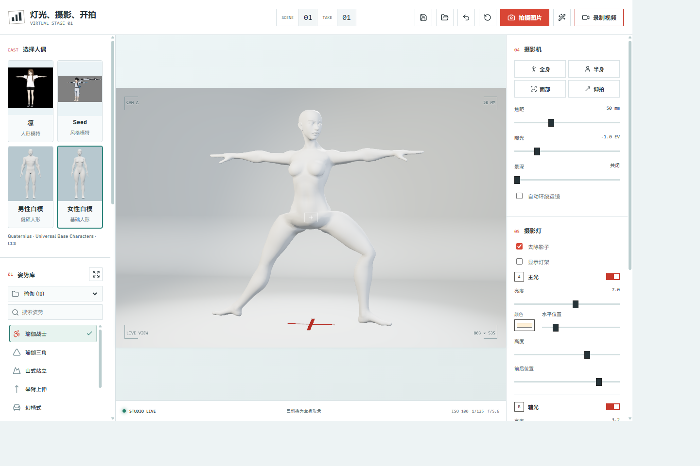
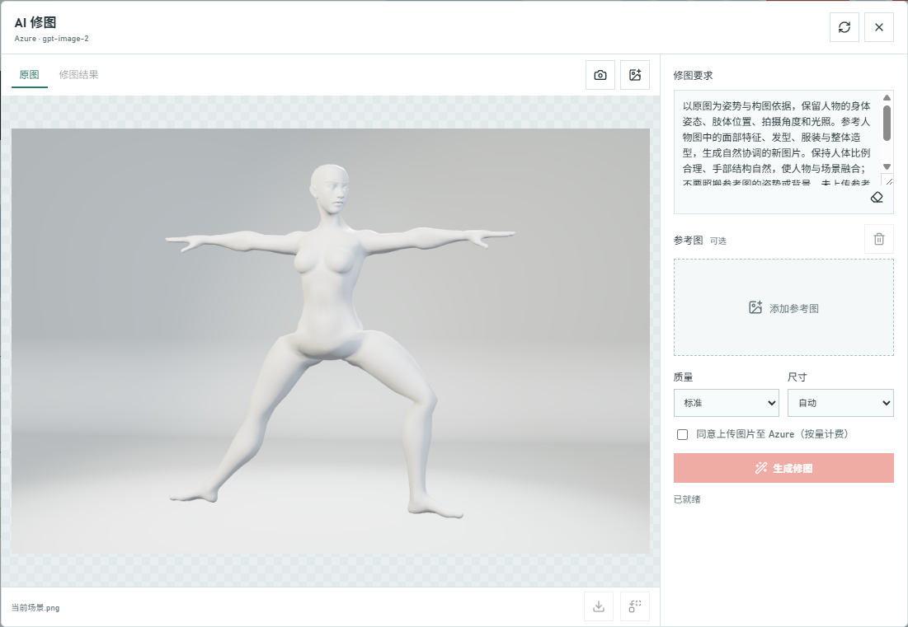
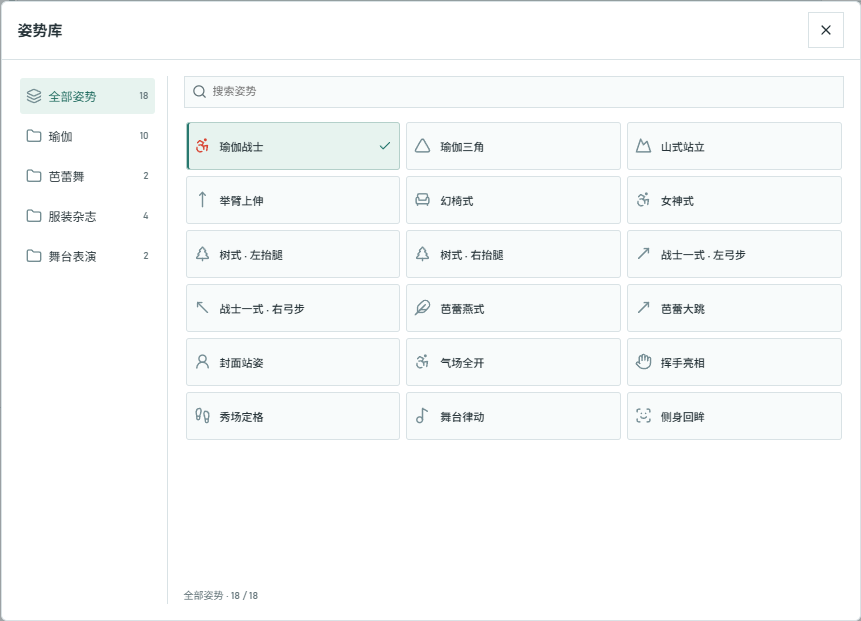

# 灯光、摄影、开拍

一个零构建的 3D 虚拟摄影棚沙盒。没有评分或任务，自由摆姿、布光、布景和拍摄。



实际运行界面：选择人偶与姿势，调整镜头和灯光，再导出照片或视频。演示使用自带的 Quaternius CC0 女性白模。

[运行](#运行) · [AI 修图](#ai-修图) · [功能](#功能) · [操作](#操作) · [编辑姿势数据](#编辑姿势数据) · [代码结构与扩展](#代码结构与扩展)

## 运行

需要 Python 3.10 或更新版本，无需 Node.js 或管理员权限。首次在项目目录的 PowerShell 终端安装本地依赖：

```powershell
python -m venv .venv
.\.venv\Scripts\python.exe -m pip install -r requirements.txt
```

之后运行：

```powershell
.\start.ps1
```

启动器自动打开默认浏览器，默认地址为 http://127.0.0.1:4173/；端口占用时自动改用后续端口，以终端输出为准。按 Ctrl+C 停止。若本机策略阻止执行脚本，可直接运行 `.\.venv\Scripts\python.exe server.py`；不要更改系统安全策略。

普通摄影棚功能也可部署到静态托管平台，但 AI 修图必须通过本地 Python 服务使用。服务只监听本机，不适合直接暴露到公网。普通浏览器可能限制 `file://` 模块加载，因此建议始终使用 HTTP。Three.js、three-vrm、Lucide 及其所需模块均已放在 `assets/vendor/`，人物模型、缩略图和姿势数据也随项目提供；普通摄影棚无需联网，不再请求 CDN。AI 修图仍需连接 Azure，首次安装 Python 依赖也需要联网。

浏览器依赖版本固定为 Three.js 0.180.0、three-vrm 3.5.5、Lucide 0.468.0。各包许可证保留在对应目录，来源、包完整性和文件 SHA-256 记录在 [资源清单](assets/vendor/manifest.json)。需要重新下载时运行：

```powershell
.\.venv\Scripts\python.exe scripts/vendor_dependencies.py --proxy http://127.0.0.1:1080
```

此脚本只通过指定代理下载固定版本的 npm 包，验证完整性并提取使用到的模块及其依赖，不修改系统或浏览器代理设置。新增第三方模块时，在脚本的入口列表中补充模块后重跑；日常启动无需执行下载。

## AI 修图



截图展示修图前的原图预览与参数设置，未上传参考图、未发起生成，不代表 AI 生成效果。真实修图需配置 Azure 并明确同意上传与计费。

在项目根目录创建 `.env`，格式参照 [.env.example](.env.example)。本地 `.env` 已被 Git 忽略，静态服务也不会提供下载；不要把密钥发到聊天或提交到仓库。

| 配置项 | 内容 |
| --- | --- |
| `AZURE_OPENAI_ENDPOINT` | Azure 资源根端点，例如 `https://your-resource.openai.azure.com`；不是 Foundry 项目 URL，也不要附加 `/openai/...` 路径 |
| `AZURE_OPENAI_API_KEY` | 对应资源的 API 密钥 |
| `AZURE_OPENAI_IMAGE_DEPLOYMENT` | 已部署的 GPT Image 2 的**部署名**，默认 `gpt-image-2`，可与模型名称不同 |
| `AZURE_OPENAI_API_VERSION` | 默认 `2025-04-01-preview`；以你的部署支持的 Images Edit API 版本为准 |

服务器读取 `.env`，同名进程环境变量优先。修改文件后在修图窗口点击“重新检查配置”即可，无需把密钥传给浏览器。未配置 Azure 不影响普通拍照。

1. 每次点击顶部的“AI 修图”图标，都会重新拍摄当前场景并显示为原图，不下载文件、不增加拍摄计数，也不调用 Azure。提示词与参考图保留；之前的生成结果单独标为“上次修图结果”，仍可查看和下载。普通拍照按钮仍照常下载 PNG。也可在修图窗口内导入已有原图。
2. 只填写修图要求，或额外上传一张人物参考图。例如：“保持原图白模的姿势、构图与布光，使用参考图人物的外观，穿白色西装，生成写实服装杂志照片。”
3. 选择质量、尺寸，确认上传与计费后点击“生成修图”。第一张始终为原图，第二张为可选参考图。Azure 收到原图、参考图和提示词；请只使用有权上传和处理的素材。
4. 在原图与结果间切换查看，下载 PNG，或点击“以结果继续修图”把结果作为下一次输入。继续修图不会自动发起新的收费请求。

每次请求生成一张图片；原图和参考图各限 8 MB、1600 万像素，支持 PNG/JPG。默认标准质量、自动尺寸，也可指定横向、竖向或方形尺寸。结果仅保存在当前页面内存，刷新后丢失，不写入项目 JSON，也不会修改 3D 模型或保证人物与姿势逐像素一致。

每次点击生成都可能计费。关闭修图窗口不取消已提交任务；重开会刷新当前场景原图，旧任务完成后不会覆盖它，可在“上次修图结果”中查看或下载。超时或断网也不代表 Azure 已取消，不会自动重试。服务同一时间只接受一个修图任务。错误提示区分缺少配置、鉴权、部署、限流、内容/参数拒绝和超时，不回传 Azure 原始错误中的敏感内容。

接口采用 Azure [Images Edit API](https://learn.microsoft.com/en-us/azure/ai-foundry/openai/how-to/dall-e#call-the-image-edit-api) 的 multipart 上传，输出 PNG。真实效果和可用性需要你自己的 GPT Image 2 部署、权限和额度；自动化测试使用模拟响应，不代表已完成真实 Azure 生成验收。

本地接口测试（不访问 Azure，不计费）：

```powershell
.\.venv\Scripts\python.exe -m unittest discover -s tests -v
```

## 代码结构与扩展

项目仍使用原生 ES 模块，没有新增框架或构建依赖。入口 [src/main.js](src/main.js) 负责装配模块、绑定摄影参数，并协调项目恢复与撤销；其余职责按功能分离：

| 模块 | 职责与扩展入口 |
| --- | --- |
| [src/studio-scene.js](src/studio-scene.js) | 无影墙、背景平面、位置标记和灯具工厂；灯光定义集中在 `LIGHT_DEFINITIONS` |
| [src/capture.js](src/capture.js) | 拍照、录制及清理；通过 `takePhoto`、`toggleRecording`、`isRecording` 接入，新增输出流程在此扩展 |
| [src/pose-schema.js](src/pose-schema.js) | 标准关节和姿势协议，不依赖渲染或界面 |
| [src/project-schema.js](src/project-schema.js) | 项目校验与默认状态；新增保存字段时同时更新这里及入口的捕获/恢复逻辑 |
| [src/pose-library.js](src/pose-library.js) | 数据文件加载与校验，新增姿势只改 JSON |
| [src/pose-browser.js](src/pose-browser.js) | 分类、搜索、弹窗和选中态，通过回调通知应用，不直接操纵角色 |
| [src/pose-store.js](src/pose-store.js) | 本地姿势覆盖与新增、持久化校验、写入失败及多页面冲突保护 |
| [src/pose-save.js](src/pose-save.js) | 保存按钮与另存窗口，采集名称和分类，通过回调提交姿势 |
| [src/character.js](src/character.js) | 人偶生命周期与骨骼编辑；IK 和白模适配继续由各自模块负责 |
| [src/retouch.js](src/retouch.js) | AI 修图界面与请求，摄影控制器通过回调提供原图 |

依赖方向保持为“入口装配 → 功能模块 → 数据协议”，模块不要反向导入入口，也不要传入可任意修改的全局应用对象。控制器每个页面创建一次，各自持有内部状态；需要其他模块完成的工作通过明确回调连接。项目和独立姿势仍使用版本 1，已有 ID 和兼容导出保持不变。加入不兼容字段前应先设计迁移策略。

### 前端回归测试

测试只使用原生浏览器与现有 Python 依赖。启动专用测试服务：

```powershell
.\.venv\Scripts\python.exe tests/serve_frontend.py --port 4176 --no-browser
```

在独立浏览器标签打开终端输出的地址，等待人偶加载，在浏览器开发者工具 Console 执行：

```js
await (await import('/tests/frontend.test.js')).runTests()
```

成功返回 `passed: 26`；任何断言失败都会抛错。覆盖完整内置目录与分类、姿势保存/另存与刷新恢复、存储损坏/写入失败/多页冲突保护、旧项目与浮空姿势、动画原模资源与项目兼容、目录扩展、场景工厂、照片恢复、录制各阶段失败清理、姿势过滤与选择。模拟失败会输出带 `Expected` 的错误日志，这是测试输入，不代表测试失败。测试使用独立 DOM、模拟存储与录制器，不调用 Azure，不下载测试照片或视频。专用服务默认仅额外开放这一个测试脚本；正常 `server.py` 仍拒绝访问测试目录，`.env` 保护不变。测试结束按 Ctrl+C 停止专用服务。

模块测试之外，修改拍摄、相机或人偶时仍应检查真实 PNG/WebM、项目保存恢复和桌面/手机端画面，不能用模拟断言替代渲染验收。

## 功能

- 五个可选人偶：两款 VRM 样例、男女白模和 Quaternius 动画原模；61 种内置姿势，默认使用瑜伽战士
- 51 个标准关节的 XYZ 旋转编辑，包含手指；支持关节控制点与旋转环
- 手腕、脚踝 IK 拖拽，自动带动肩肘或髋膝，带基本肘膝限位及可达距离限制
- 独立姿势 JSON 导入导出，换人偶时保留姿势
- 姿势库保存与另存为，支持自定义名称和分类，刷新后保留本地修改
- 三灯开关、亮度、颜色与 XYZ 位置；灯架显示开关
- 默认开启“去除影子”，可随时恢复投影，保留灯光和材质明暗
- 连续弧形无影墙，地面与背景墙平滑相接；六种摄影背景以及本地图片导入
- 自由镜头、焦距、曝光与景深
- 全身、半身、面部及仰拍一键取景，默认曝光 -1 EV
- 分区物理材质：皮肤、头发、衣料和眼部采用不同反光；保留原法线贴图，贴图过滤最高 8 倍各向异性
- 四种构图比例
- PNG 图片和 WebM 视频导出
- Azure Foundry GPT Image 2 修图：提示词、可选人物参考图、原图/结果预览与 PNG 下载
- 基础撤销与摄影棚重置
- 自动环绕运镜
- JSON 项目保存和恢复，背景图片包含在项目文件中

## 操作

自动贴地根据当前变形后的鞋脚网格最低点计算高度，不再以脚踝关节加固定偏移估算；保留极小离地间隙，避免鞋底与地面重叠闪烁。

姿势库包含 61 种内置预设：保留原有 18 种（含 10 种瑜伽），另加入 Quaternius 第一套 Standard 免费版的全部 43 段动画各一个静态采样，包括参考 T 姿势。新增条目直接写入 [assets/poses/library.json](assets/poses/library.json)，无需手动导入、另存或本地存储；打开任何新浏览器都会显示。

| Quaternius 分类 | 数量 |
| --- | ---: |
| 基础站姿 | 2 |
| 日常交流 | 6 |
| 坐姿蹲姿 | 7 |
| 行走跑跳 | 7 |
| 舞蹈游泳 | 3 |
| 格斗施法 | 8 |
| 持械瞄准 | 6 |
| 倒地翻滚 | 4 |

原有预设继续保留当前朝向和高度；Quaternius 预设带有自己的朝向与贴地/浮空状态。游泳和腾空使用浮空状态，倒地与翻滚按三个 Quaternius 模型的全身最低点计算保守高度。其他体型或进一步修改关节后可能需要微调高度与肢体接触。坐姿、驾驶、持械等仅包含人物姿势，不包含椅子、车辆或武器。这些是可编辑的静态姿势，不是动画播放或瑜伽教学。

姿势库按瑜伽、芭蕾舞、服装杂志、舞台表演分类。侧栏提供文件夹选择、当前文件夹搜索和独立滚动的紧凑列表；选择“全部姿势”可跨分类搜索。标题右侧的展开按钮打开大尺寸浏览窗口，选中姿势后自动收起，Esc 或关闭按钮也可返回。浏览条件在展开和收起之间保留，不改变人物姿势；当前姿势名称显示在列表下方。分类是预设的逻辑文件夹，导入 JSON 仍用于应用单个姿势，不会自动存入姿势库。



展开模式集中浏览所有分类与预设；新增姿势或分类只需更新 [姿势数据文件](assets/poses/library.json)，刷新后自动显示。

### 保存与另存姿势

姿势名称下方依次是保存、另存为、导入、导出按钮，悬停可查看名称。

- **保存**：选择库中姿势并调整后，点击磁盘图标，覆盖该条目的本地版本，保持名称、分类和 ID 不变。名称旁的“未保存”表示有编辑，按钮提示显示保存目标。
- **另存为**：点击复制加号图标，填写名称和分类。可选择已有分类或输入新分类；同一分类下不允许同名。保存后自动选中新条目，原姿势不变；取消不会写入。
- 保存内容包括全部关节角度、人物朝向、自动贴地开关与浮空高度，不包含人物模型、相机、背景或灯光。导入外部姿势后先使用“另存为”，不会直接覆盖之前选中的预设。
- 本地姿势存入当前浏览器、当前站点地址的 `localStorage`，刷新和重新打开同一地址后仍在；不会改写仓库 JSON，也不会上传 Azure。内置预设的本地版本优先于数据文件中的同 ID 条目。
- 不同浏览器、端口或 `localhost`/`127.0.0.1` 地址不共享这份库；清除站点数据会删除本地保存。重要姿势请通过导出按钮备份为 JSON，在其他环境导入后另存。项目文件保留当前场景的完整姿势，但不会备份整份库；打开缺少对应库条目的项目时恢复为自定义姿势，可再另存到本地库。
- 存储空间不足或数据损坏时显示错误，不提示保存成功；检测到其他页面已更新库时阻止旧页面覆盖，请先导出当前姿势再刷新。撤销和重置作用于场景，不撤回已保存的库条目。

摄影灯面板中的“去除影子”默认勾选，关闭场景投影和自阴影，但不改变灯光强度或材质反光。取消勾选可恢复阴影。开关随项目保存，支持撤销；重置和未包含此字段的旧项目默认去影，照片与视频沿用当前设置。

拖动视口旋转镜头，滚轮缩放，鼠标右键拖动平移；触摸单指旋转、双指缩放和平移。选择关节后用 XYZ 滑块或数值输入摆姿；打开关节控制点后，也可点选身体关节并拖动旋转环。点击预设会重置手动修改。拍照前可关闭灯架显示，关节辅助线在拍照和录像时自动隐藏。

姿势区的上传、下载按钮读写独立的 `studio-pose` JSON 文件，上限 128 KB，角度单位为弧度。五个可选人偶共用标准化关节和姿势文件，但不同体型和服装可能需要调整关节以避免穿插；裙装没有布料碰撞模拟。男女白模与动画原模均保留五指骨骼，支持 FK、四肢 IK、贴地、浮空与项目保存。动画原模保留官方橙色主体和紫色关节，仅内置约 615 KiB 的模型，不加载整套动画。VRoid A／B／C 试用模型因姿态与视觉质量未通过验收，已从选择列表撤下；文件及角色 ID 暂留以兼容试用期间保存的项目，不代表已验证可用。

Quaternius 第一套免费版全部 43 个静态姿势已按分类内置。来源、采样方式和验证记录见[测试报告](tests/QUATERNIUS_TRIAL.md)。此前保存在浏览器中的五个试用记录属于个人本地库，仍会保留，不影响内置条目。

在“手动摆姿”中选择“IK 拖拽 + 关节精调”，直接拖动四个放大的手脚控制点。全部关节选择、XYZ 角度输入和重置仍然可用，其他身体关节仍可通过旋转环调整；选择“旋转关节 · FK”可对手脚使用旋转环。拖拽在当前视图平面内进行，调整前后深度时先转动镜头。IK 结果保存在同一份姿势数据里，支持撤销和姿势文件往返。当前不提供全身 IK、碰撞避让、肘膝方向手柄或持续脚底锁定。

取消“自动贴地”，再调整“人物高度 Y”即可浮空。关闭贴地时保持当前高度，之后修改姿势、弯腿或 IK 拖脚都不会自动落地。高度是人物整体的垂直位移，不是脚底离地距离；滑杆范围为 -10 至 10，数字框支持 -1000 至 1000。浮空状态随姿势文件、项目和撤销保存，切换预设或人偶时保留；重新勾选自动贴地或重置摄影棚可回到贴地状态。旧文件没有高度数据时默认贴地。

摄影机面板提供全身、半身、面部和仰拍取景。“仰拍”进入低机位，其余取景保留当前观察方向；取景暂停自动环绕，可继续自由运镜。镜头可旋转、平移和缩放，不再设定拍摄距离、地板高度或额外仰俯角限制，允许进入地板下方；远裁剪面随机位扩展。自由机位支持保存和撤销。默认曝光 -1 EV，可调范围约 -3 至 +1 EV；重置恢复 -1 EV，已有项目保留其保存的曝光。

顶部保存按钮下载项目 JSON；打开按钮恢复项目。背景图接受 8 MB 以内的 PNG、JPEG、WebP，项目文件上限 13 MB。项目与背景导入只在本地读取；只有明确提交 AI 修图时才会上传修图输入到 Azure。

## 编辑姿势数据

内置预设统一存放在 [assets/poses/library.json](assets/poses/library.json)，不用再修改 JavaScript 或 HTML。修改并保存后刷新页面生效，无需重启服务；同 ID 的本地保存版本会优先显示。刷新前请保存项目和需要保留的修图结果。

顶层 `version` 固定为 `1`，`units` 固定为 `radians`，`defaultPose` 是初始及重置时使用的姿势 ID。`poses` 数组顺序即列表顺序，分类按首次出现顺序排列。新增姿势时向数组添加一个对象，例如：

```json
{
	"id": "relaxedStanding",
	"name": "自然站姿",
	"folder": "日常姿势",
	"icon": "user-round",
	"joints": {
		"leftUpperArm": [0, 0, -1.45],
		"rightUpperArm": [0, 0, 1.45]
	}
}
```

- `id`：唯一英文 ID，以字母开头，可包含数字、下划线和连字符，最长 64 字符。已有 ID 不要随意更改或删除，旧项目依赖它恢复。
- `name`、`folder`：显示名称和分类，各不超过 80 字符；新的 `folder` 值自动创建逻辑文件夹，无需修改导航。
- `icon`：可选的 Lucide 图标名，省略时使用 `user-round`。
- `joints`：标准关节名到 `[X, Y, Z]` 弧度角的映射，单轴范围为 `-π` 到 `π`。JSON 中必须写数值，例如 `1.5707963267948966` 表示 90°，不能写 `Math.PI / 2`。未填写的关节恢复默认姿态。

可先在界面调整关节，导出姿势 JSON，再将其中的 `joints` 对象放入预设；也可直接使用界面的保存/另存功能建立本地版本。目录条目可选填写 `rotation`（弧度）及 `placement`（`grounded`、`height`）；未填写时切换保留当前朝向与高度，界面保存的本地版本包含这两个字段。导入单个姿势不会自动改写数据文件。加载器会拒绝重复 ID、未知关节、非法角度及不存在的默认姿势，并显示错误；不会静默跳过坏数据。

## 输出与限制

- 图片：PNG，长边 1920 像素，不含界面、取景框和地面定位十字；AI 修图接收同一张无定位标记的原图。定位十字仍保留在编辑视图中。
- 视频：WebM，视口分辨率，最多 30 fps，无音轨；实时帧率取决于设备。
- 录制期间仍可运镜、切换姿势预设和打光；姿势控制点自动隐藏，编辑模式、改变画幅、拍照、重置和项目加载暂时禁用。
- 当前提供风格化 VRM 样例、男女基础人形白模和动画原模，不是写实明星；暂不提供外部人偶导入、网格雕刻、换装和关键帧时间轴。
- VS Code 集成浏览器不能直接播放本次生成的视频；独立媒体库已成功解析并解码录制帧。请在普通浏览器或 WebM 播放器中查看下载文件。

## 依赖

- [Three.js](https://github.com/mrdoob/three.js)，MIT，固定版本 0.180.0。
- [Lucide](https://github.com/lucide-icons/lucide)，ISC，固定版本 0.468.0。
- [three-vrm](https://github.com/pixiv/three-vrm)，MIT，固定版本 3.5.5；已验证与 Three.js 0.180.0 的聚光灯阴影兼容。
- 人偶来自 pixiv 和 VirtualCast 的官方 VRM 样例，采用 VRM Public License 1.0；详见 [素材许可](assets/characters/README.md)。发布 Seed-san 的图片或视频时请署名 `Seed-san by VirtualCast, Inc.`，并遵守模型许可。
- 已撤下的 VRoid A／B／C 试用素材来自固定版本的社区镜像，原作者为 VRoid / pixiv Inc.，采用独立的 VRoid 示例模型使用条件，并非 CC0。暂留文件的来源、摘要和分发限制见 [素材许可](assets/characters/README.md)。
- 男女白模基于 Quaternius Universal Base Characters 的 CC0 素材，来自固定版本公开副本；派生为无外部贴图的白色 GLB。模型来源、处理方式与缩略图说明见 [素材许可](assets/characters/README.md)。
- 动画原模和 43 个新增内置姿势来自官方 Universal Animation Library Standard 免费包，采用 CC0；保留原模型配色，仅移除运行时不需要的动画。官方来源和文件哈希见 [素材许可](assets/characters/README.md)。

详细设计见 [DESIGN.md](./DESIGN.md)。