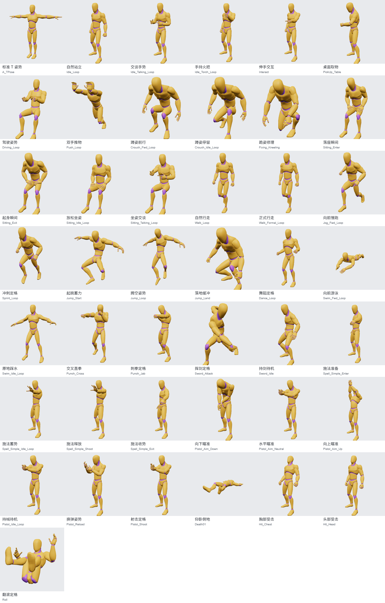
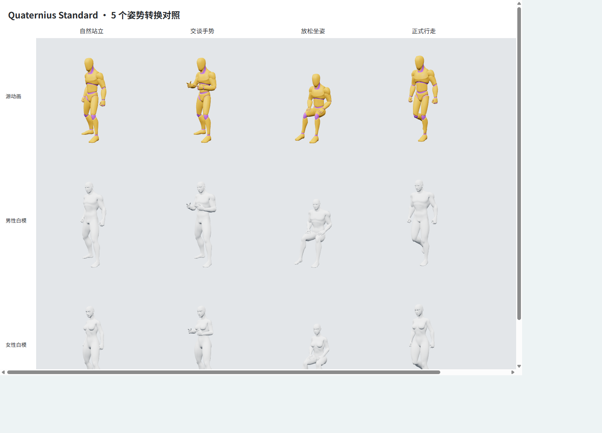

# Quaternius 第一套免费版内置姿势

状态：原模已加入选择器，官方全部 43 段动画（包含 T 姿势）各采样一个静态姿势，已分类写入正式内置库；加上原有 18 个，共 61 个，无需手动导入或浏览器本地存储。来源为官方 Universal Animation Library Standard 免费包，CC0；不是第二套或 Pro 版，也不是先前检查过的旧社区镜像。

分类：基础站姿 2、日常交流 6、坐姿蹲姿 7、行走跑跳 7、舞蹈游泳 3、格斗施法 8、持械瞄准 6、倒地翻滚 4。完整名称、来源动画和时间戳见 [library.json](../assets/poses/library.json)。运行时不依赖动画源 GLB。



常规前端回归 26 项通过，包含空本地存储加载和八个分类的数量、选择行为。独立检查页在 1440 与 390 像素宽度下验证了 61 个内置条目、分类、浮空状态、无横向溢出和非空渲染；未修改用户本地姿势。

## 初期五个样本留档

以下 JSON 是初期五样本验证的留档；这些姿势现在也已内置，不需要再导入。每份文件包含 51 个关节、朝向与贴地状态，以及来源和采样时间。

| 名称 | 原动画 | 采样时间（秒） | 文件 |
| --- | --- | --- | --- |
| 自然站立 | Idle_Loop | 0.625 | [ual1Idle.json](fixtures/quaternius/ual1Idle.json) |
| 交谈手势 | Idle_Talking_Loop | 1.026667 | [ual1Talking.json](fixtures/quaternius/ual1Talking.json) |
| 放松坐姿 | Sitting_Idle_Loop | 0.5 | [ual1Sitting.json](fixtures/quaternius/ual1Sitting.json) |
| 正式行走 | Walk_Formal_Loop | 0.266667 | [ual1Walking.json](fixtures/quaternius/ual1Walking.json) |
| 舞蹈定格 | Dance_Loop | 0.35 | [ual1Dance.json](fixtures/quaternius/ual1Dance.json) |

坐姿不包含椅子，持械等姿势不包含道具。游泳和腾空使用浮空状态；倒地、翻滚根据三个 Quaternius 模型的全身最低点设置保守高度，避免只按脚底对齐造成穿地。不同体型的身体接触位置可能需要微调；肢体方向检查不等于无穿模保证。不提供连续动画播放。

已知限制：交谈姿势下，左手某些 IK 拖拽目标存在求解残差（原模约 0.086 个场景单位，男性白模约 0.077）；重复求解未消除。该情况在现有白模也能复现，本次未改动 IK 算法。精调此类手势可使用 FK。中立姿势下三个模型的四肢 IK 共 12 个目标均单独检查，允许误差小于 0.0001 个场景单位。



## 验证与复现

- 官方 GLB 共 43 段动画，包含参考 `A_TPose`；下载来源、精简模型和 SHA-256 见[素材说明](../assets/characters/README.md)。完整动画源只保留在临时目录，不随应用分发。
- 使用校准到 T 姿势的骨架作为参考，计算原始骨骼的世界旋转差，再转换成标准化父子关节的局部旋转；合并未暴露的中间关节旋转，不直接复制原始欧拉角。
- `verifyTrial` 检查原模、男性白模和女性白模的 129 个组合：51 关节合法性、姿势完整往返、8 个四肢骨段方向、贴地或浮空时的全身高度。方向误差上限 4°。参考 T 姿势最大关节角约 1.97°；另外验证 12 个中立姿势 IK 目标。

从[官方页面](https://quaternius.itch.io/universal-animation-library)选择免费的 Standard ZIP，解压 `Unreal-Godot/UAL1_Standard.glb`。需要代理时使用 `http://127.0.0.1:1080`，本机地址不走代理。然后启动独立测试服务：

```powershell
$env:QUATERNIUS_TEST_SOURCE = 'C:\path\to\UAL1_Standard.glb'
.\.venv\Scripts\python.exe tests/serve_frontend.py --port 4176 --no-browser
```

在该服务的摄影棚页面 Console 执行：

```js
const { createTrial, verifyTrial } = await import('/tests/quaternius-trial.js');
const trial = await createTrial();
const { buildCatalog } = await import('/tests/quaternius-trial.js');
const base = await (await fetch('/assets/poses/library.json')).json();
const regenerated = buildCatalog(base, trial);
console.assert(regenerated.poses.length === 61);
const verification = await verifyTrial(trial);
console.table(verification.results);
console.table(verification.ikResults);
```

源文件哈希不匹配时会拒绝转换。测试服务仅在设置该环境变量后开放探针脚本与指定源文件的只读路由；正常应用没有这些路由，也没有写入项目文件的接口。验证后刷新或关闭检查页以释放临时模型。